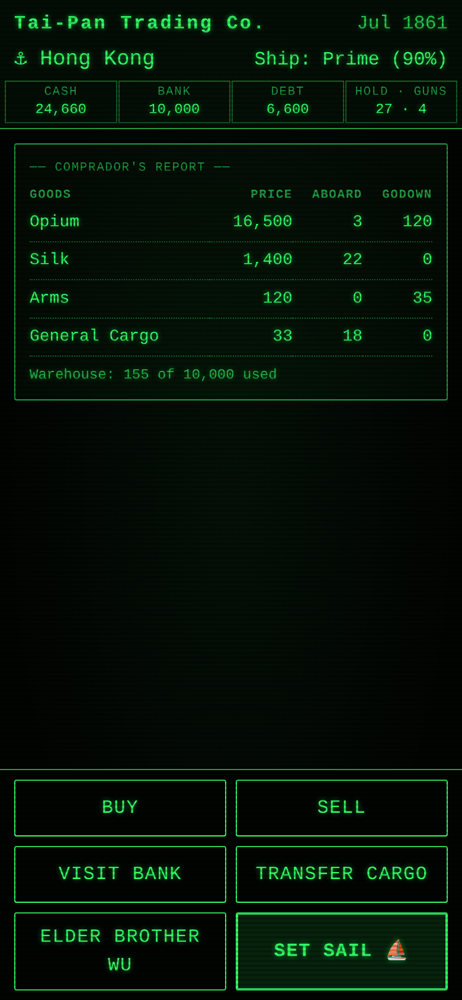
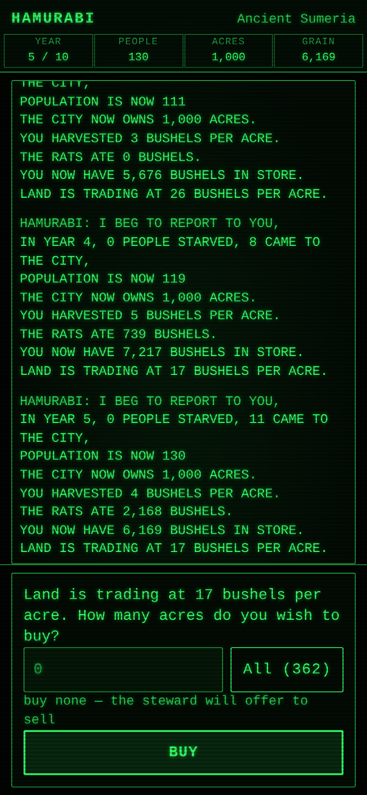
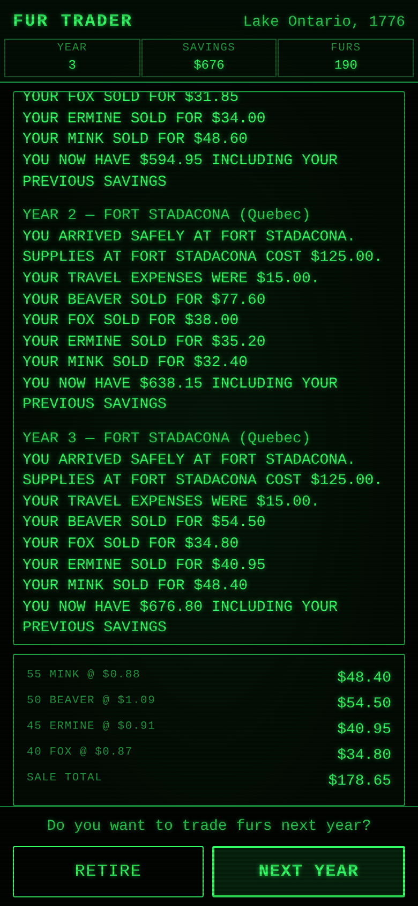
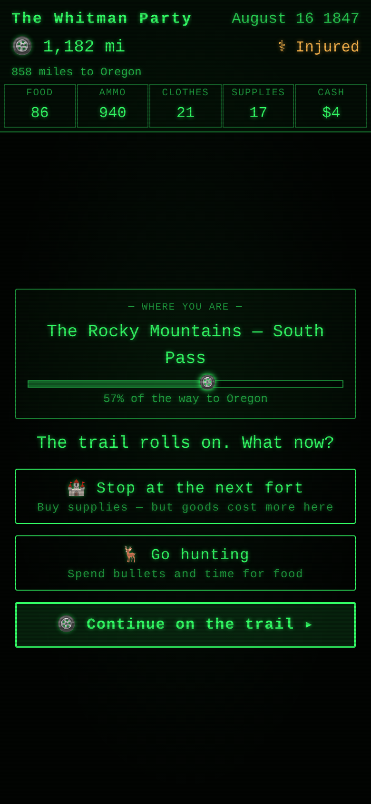
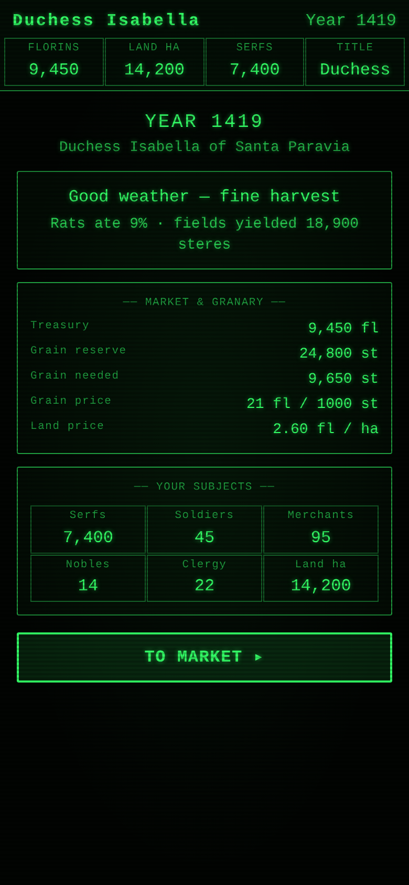
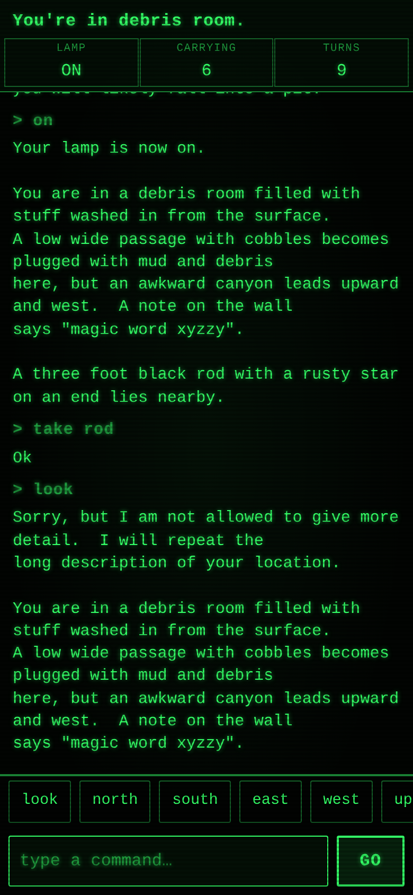

# Riparion Retro

A collection of mobile-first, WASM games with a shared green-phosphor CRT
aesthetic, built with [Dioxus](https://dioxuslabs.com) and organized as a
Cargo workspace — one crate per game under `games/`.

| Game | | Description |
|---|---|---|
| [taipan](games/taipan/) |  | Faithful port of Art Canfil's 1982 Apple ][ trading classic |
| [hammurabi](games/hammurabi/) |  | The 1968/1978 BASIC city-state classic — rule Sumeria for ten years |
| [fur-trader](games/fur-trader/) |  | The 1976 BASIC fur-trading classic — outfit expeditions from Lake Ontario |
| [oregon-trail](games/oregon-trail/) |  | The 1975 MECC classic — lead a wagon party 2,040 miles to Oregon City |
| [dukedom](games/dukedom/) |  | The 1980 Creative Computing classic — rule a medieval duchy through plague, war, and the High King's taxes |
| [santa-paravia](games/santa-paravia/) |  | George Blank's 1978 city-state sim — rule a Renaissance Italian city-state and rise from Sir to King |
| [adventure](games/adventure/) |  | Crowther & Woods' 1977 **Colossal Cave Adventure** (350-point version) — explore the cave, gather treasure, dodge dwarves |

## Layout

```
├─ Cargo.toml          # workspace: members = ["crates/*", "games/*"], shared deps & release profile
├─ clippy.toml         # workspace-wide lints (e.g. no signal borrows across .await)
├─ AGENTS.md           # Dioxus 0.7 guide for AI assistants
├─ crates/
│  └─ retro-kit/       # shared library: the games' common look & plumbing
│     ├─ assets/crt.css  # green-phosphor CRT theme (scanlines, buttons, panels…)
│     └─ src/
│        ├─ theme.rs     # class-string constants (BTN, PANEL, ACTION_BAR…)
│        ├─ components/  # generic UI (NumberEntry numeric keypad entry)
│        ├─ rng.rs       # seedable, serializable BASIC-style `FN R(X)` RNG
│        ├─ format.rs    # fmt_money / group_thousands
│        └─ storage.rs   # versioned localStorage saves + high-score tables
└─ games/
   └─ taipan/          # each game is a self-contained Dioxus web crate
      ├─ Cargo.toml    #   inherits versions via { workspace = true }
      ├─ Dioxus.toml   #   per-game dx config
      ├─ tailwind.css  #   per-game Tailwind input (dx auto-compiles)
      ├─ assets/       #   game-specific css/icons only
      └─ src/
```

## Working on a game

```bash
cd games/taipan
dx serve                 # develop with hot reload
dx build --release --debug-symbols=false --keep-names   # production wasm bundle

# From the workspace root:
cargo test               # all engine test suites
cargo clippy --all-targets
```

## Adding a new game

```bash
scripts/new-game.sh <name>      # scaffolds games/<name>/ wired to retro-kit
```

**See [NOTES.md](NOTES.md) for the full recipe** — scaffold, architecture
pattern, Dioxus pitfalls, and the verification checklist. The short version:

1. `mkdir games/<name>` with a `Cargo.toml` that inherits from the workspace
   (copy `games/taipan/Cargo.toml` as a starting point) — `members = ["games/*"]`
   picks it up automatically.
2. Add a `Dioxus.toml` and (optionally) a root-level `tailwind.css` next to the
   crate's `Cargo.toml` for automatic Tailwind.
3. Pin new shared dependencies in `[workspace.dependencies]` at the root, not
   in the game crate.

## Sharing the aesthetic

New games get the Taipan look by depending on `retro-kit` and linking its
stylesheet once at the app root:

```rust
use dioxus::prelude::*;

rsx! {
    document::Stylesheet { href: retro_kit::CRT_CSS }  // shared CRT identity
    document::Stylesheet { href: MAIN_CSS }            // game-specific extras
}
```

Then build screens from `retro_kit::theme` classes (`crt-btn`, `crt-panel`,
`chip`, `action-bar`…), `retro_kit::components` (e.g. `NumberEntry`), and the
`rng`/`format`/`storage` primitives. Keep game-specific CSS in the game's own
`assets/`, layered on top of `crt.css` — don't fork the shared palette.

## License

Licensed under either of

- Apache License, Version 2.0 ([LICENSE-APACHE](LICENSE-APACHE) or
  <http://www.apache.org/licenses/LICENSE-2.0>)
- MIT license ([LICENSE-MIT](LICENSE-MIT) or
  <http://opensource.org/licenses/MIT>)

at your option.

Unless you explicitly state otherwise, any contribution intentionally
submitted for inclusion in the work by you, as defined in the Apache-2.0
license, shall be dual licensed as above, without any additional terms or
conditions.

Game designs ported here (e.g. Taipan, by Art Canfil) belong to their
original creators; this repository's licenses cover the source code of
these reimplementations.
