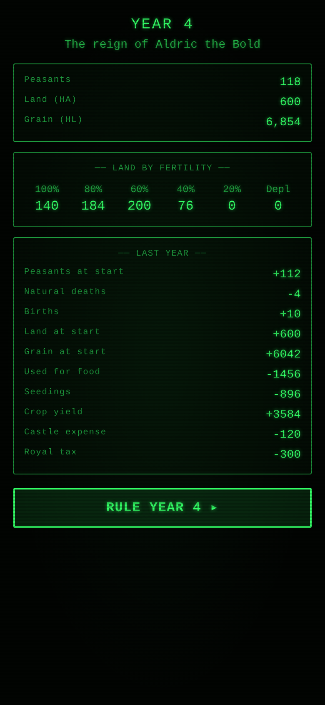

# Dukedom



A mobile-first, WASM port of **Dukedom**, the deepest of the Hammurabi-lineage
city-state sims (Hammurabi → Kingdom → Dukedom), built with
[Dioxus](https://dioxuslabs.com) 0.7. You are a medieval Duke: each year you feed
your peasants, work the land, and weather rats, seven-year locusts, plague, rival
Dukes, and the High King's ever-grasping taxes. Rule for 45 years with the crown
appeased to retire in glory — or defeat the King's army and seize the throne
yourself.

The mechanics are a faithful reimplementation of the canonical Microsoft BASIC
version (Richard Kaapke, *Creative Computing*, Feb 1980), via the C port at
[caryo/Dukedom](https://github.com/caryo/Dukedom): the exact yield, feeding,
land-fertility, war, plague, and royal-tax formulas — preserving even the
original's integer-truncation quirks — with the per-game `gauss`-seeded event
means and the `FNX` random spread.

## Playing

Each year you make three decisions, then watch the realm react:

- **Feed the peasants** — about 13 HL of grain per peasant survives the winter;
  below that they starve, and below 11 HL they grow restless. Starvation and
  unrest both depose Dukes.
- **Buy or sell land** — land is priced in grain (and the price swings yearly).
  One deal per year: grow your holdings in flush years, or sell to eat in lean
  ones. Bought land is mediocre; rested fields slowly regain fertility while
  cropped ones tire.
- **Plant the fields** — 2 HL of seed per HA, and each peasant can work at most 4
  HA. The harvest yield depends on how fertile the land you sowed was.
- **Then fate intervenes** — rats, locusts, plague, and rival Dukes take their
  turn; the King levies grain and peasants, and if you refuse his double-tax he
  marches on you.

Other niceties:

- **How to Rule** — an in-game rules screen (the 1980 original gave none).
- **Touch-first UI** — big buttons, numeric entry, no keyboard needed.
- **Auto-save** — persists to localStorage every step; refresh and you resume
  exactly where you left off, even mid-war.
- **Hall of Dukes** — a local high-score table. The original kept no score, so
  this one ranks reigns by outcome (High King ≫ honourable retirement ≫ any
  failure), then years ruled, then the estate you leave behind.

## Development

```
src/
├─ engine/        # Pure game rules — no UI deps, fully unit-tested on host
│  ├─ state.rs    #   peasants/land/grain, fertility tiers, King state, modes
│  ├─ phases.rs   #   the 14 yearly phases: feed, starve, plant, yield, war, …
│  ├─ scoring.rs  #   synthesized score, the Serf→High King rank ladder
│  ├─ interaction.rs # the engine↔UI message/decision contract
│  └─ mod.rs      #   Game struct, BASIC RNG idioms, the year-phase state machine
├─ storage/       # localStorage save/resume + high scores
├─ ui/            # Dioxus components & screens (CRT theme)
└─ app.rs         # Signal<Game> root, mode dispatch, auto-save effect
```

The year's procedural BASIC loop is modelled as a serialized `Phase` cursor: a
single `run_phases` driver walks the phases, pausing on the full-screen inputs
(feed / land / plant) and queueing the in-stride decisions (the King's demands,
the chaos of war) so a refresh resumes mid-year — including mid-battle.

```bash
dx serve              # develop (Tailwind compiles automatically)
cargo test            # engine test suite (runs on host, no browser)
cargo clippy --all-targets
dx build --release --debug-symbols false --keep-names true    # production wasm bundle
```

The CRT identity comes from `retro-kit`; Tailwind handles layout only.
