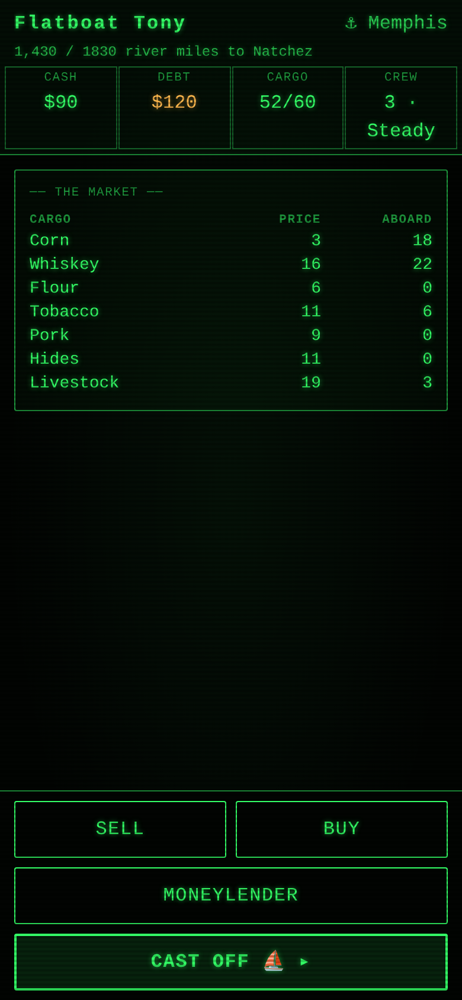

# Kaintuck

A mobile-first, WASM game built with [Dioxus](https://dioxuslabs.com) 0.7. You
are a **Kaintuck** — a frontier trader in the early 1800s. Commission a flatboat
in Pittsburgh, load it with cargo, ride the current down the Ohio and Mississippi
to **Natchez**, sell everything (the boat included), and walk 450 miles home up
the **Natchez Trace** with cash in your pockets and outlaws on every side.

**Two phases. One life. Don't get robbed.**

<p></p>

An original design that fuses two engines from this collection: the cargo-trading
of [`../taipan`](../taipan) for the river, and the distance-walk of
[`../oregon-trail`](../oregon-trail) for the Trace. One serializable `Game`
carries both; a `phase` field gates which half is live.

## Phase 1 — The River (Pittsburgh → Natchez)

The current does the work; you manage risk, not propulsion.

- **Build & load at Pittsburgh** — pick a boat (Skiff / Flatboat / Broadhorn —
  bigger hauls more but draws deeper water), hire a crew, and load cargo on
  boatyard credit: corn, whiskey, flour, tobacco, pork, hides, livestock.
- **Trade downstream** — prices climb the farther south you carry goods. Sell at
  Wheeling, Cincinnati, Cairo, or Memphis, or hold out for Natchez; borrow from
  the moneylenders at Cincinnati and Memphis.
- **River hazards** — sandbars and snags (steady-hand / order-memory), river
  pirates (quick-draw), spoilage, crew desertion, and floods (bucket-brigade).
- **The Falls of the Ohio** at Louisville — hire a pilot, run the rapids
  yourself, or wait for high water.
- **Natchez Under-the-Hill** — sell the cargo, break the boat up for lumber, risk
  a night gambling, and buy a horse before the long walk.

## Phase 2 — The Trace (Natchez → Nashville)

You carry cash now. Everyone knows it.

- **Pace & company** — push hard for miles at the cost of strength, or travel
  steady; band together with other Kaintucks to draw off the bandits.
- **The stands** — Mount Locust, Buzzard Roost Spring, and the Tennessee Valley
  Divide: rest, resupply, and (at Buzzard Roost) trade for a horse.
- **Trace hazards** — Sam Mason's gang and the Harpe brothers (quick-draw),
  swamp fever (a dosing game), getting lost on side trails (route-memory), and
  swamp crossings. The **Duck River** ford is where a horse earns its keep.
- **Home** — your score is cash brought back, crew who survived, your reputation,
  and whether you were robbed on the Trace.

## Architecture

Strict engine/UI split (see [`../../NOTES.md`](../../NOTES.md)). `src/engine/` is
pure, host-tested Rust — all rules, randomness, and the two-phase state machine;
`src/ui/` is a thin Dioxus renderer that calls engine methods. Hazards reuse the
shared [`minigames-kit`](../../crates/minigames-kit) components; the look and the
storage/RNG/format helpers come from [`retro-kit`](../../crates/retro-kit).

## Playing locally

```bash
cd games/kaintuck && dx serve      # then open the served URL
cargo test -p kaintuck             # engine suites + a multi-seed full playthrough
```

Ported to mobile by Tony Bierman.
