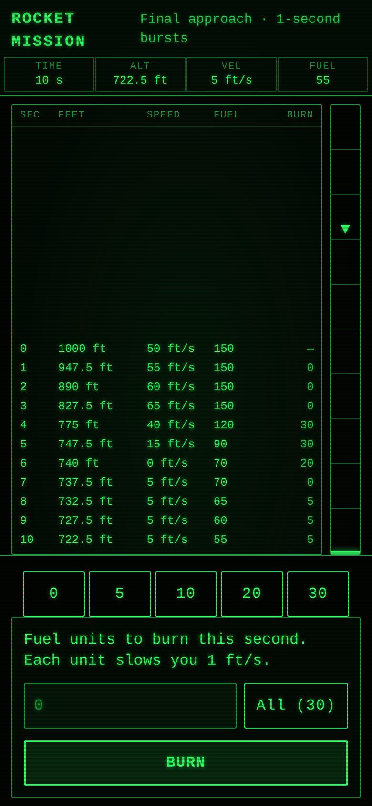

# Lunar Lander

A mobile-first WASM port of the most-played game of the early computing era,
from *BASIC Computer Games* (1978) — two faithful mission modes in one app:



- **LUNAR** — Jim Storer's 1969 classic: the Apollo capsule, 120 miles up at
  3,600 MPH. Set the retro-rocket burn (0–200 lb/s) every 10 seconds;
  physics is the original's truncated-series Tsiolkovsky rocket equation.
- **ROCKET** — Eric Peters' arcade-paced version: 1,000 feet up, falling
  50 ft/s, with 150 fuel units burned in 1-second bursts. The original's
  ASCII distance plot became the vertical descent strip.

The LEM variant from the same book is deliberately omitted (its published
physics is buggy). Both modes here are fully deterministic — no RNG — so
every landing is pure piloting. Telemetry, thresholds (a perfect LUNAR
landing is ≤ 1.2 MPH), fuel-out free fall, and the crater-depth taunt all
match the BASIC listings line for line.

The originals kept no scores; the local flight records reward fuel economy
plus a softness bonus, per mission. Descents auto-save and resume on reload.

```bash
dx serve            # develop
dx build --release  # production wasm bundle
cargo test -p lunar-lander   # engine suite (host, no browser needed)
```
